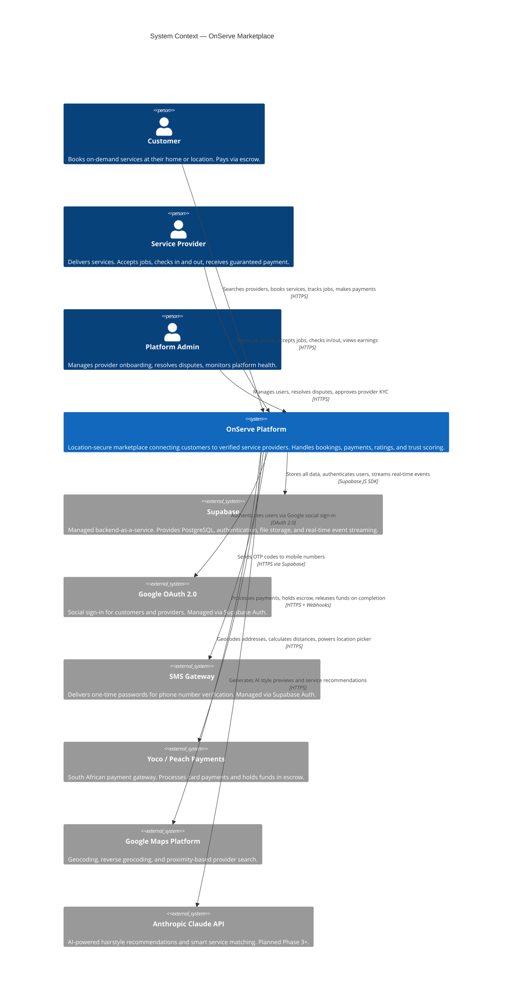
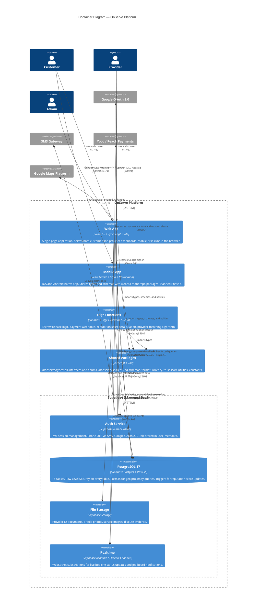
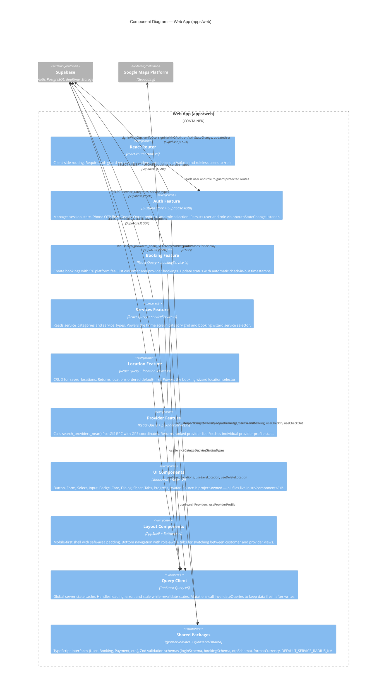
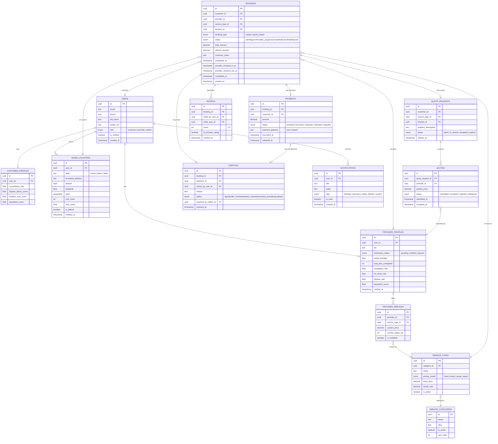

# OnServe

> **The operating system for informal services in South Africa.**

OnServe is a location-secure, trust-first marketplace connecting South Africans to on-demand home and professional services — backed by identity verification, escrow payments, and dual-reputation accountability.
---

## Table of Contents

1. [Business Overview](#1-business-overview)
2. [C4 Level 1 — System Context](#2-c4-level-1--system-context)
3. [C4 Level 2 — Container Diagram](#3-c4-level-2--container-diagram)
4. [C4 Level 3 — Component Diagram](#4-c4-level-3--component-diagram)
5. [C4 Level 4 — Data Model](#5-c4-level-4--data-model)
6. [Technical Reference](#6-technical-reference)
7. [Development Setup](#7-development-setup)

---

## 1. Business Overview

### 1.1 Problem Statement

South Africa has a large informal services economy — cleaners, plumbers, electricians, beauticians, photographers — where supply and demand are fundamentally mismatched:

- **Customers** have no reliable way to find, vet, and pay a trusted service provider at their location.
- **Providers** have no platform to build a verified reputation or receive guaranteed payment.
- **Trust** is the central barrier: customers fear no-shows and fraud; providers fear non-payment.

Existing solutions (Facebook groups, WhatsApp referrals, Gumtree) offer no accountability, no payment protection, and no reputation system.

### 1.2 Solution

OnServe is a structured marketplace with three trust mechanisms built into every transaction:

| Mechanism | What it does |
|---|---|
| **Identity verification** | Providers submit ID documents before their first job. Customers are KYC-lite via phone OTP. |
| **Escrow payments** | Funds are held in escrow at booking time and only released on job completion — neither party can be defrauded. |
| **Dual reputation** | Both the customer and provider rate each other after every job. Bad actors on either side lose access over time. |

### 1.3 Primary Actors

| Actor | Role | Core need |
|---|---|---|
| **Customer** | Books and pays for services at their location | Find a reliable, verified provider quickly and safely |
| **Provider** | Delivers services, manages jobs, receives payment | Consistent work with guaranteed payment on completion |
| **Admin** | Manages platform health and dispute resolution | Operational tools to maintain trust and quality at scale |

### 1.4 Business Model

OnServe operates on a **commission-based marketplace model**:

- A **5% platform fee** is added to every booking at checkout (applied in `bookingService.createBooking`).
- Future revenue streams: premium provider listings, promoted search placement, subscription tiers for high-volume providers.

### 1.5 Service Categories (Live)

Eight categories are seeded in the production database with four live service types:

| Category | Example Service Types |
|---|---|
| Cleaning | Standard Clean (R450), Deep Clean, Move-out Clean |
| Beauty | Facial, Braiding, Nails |
| Plumbing | Leak Repair, Geyser Service |
| Electrical | Fault Finding, Installations |
| Gardening | Lawn Mowing, Tree Trimming |
| Photography | Events, Portraits |
| Catering | Private Chef, Events |
| Tutoring | Maths, Science, Languages |

### 1.6 Customer Journey

```
Splash → Login (OTP or Google) → Role Select → Home (service grid)
  → Search providers near me → View provider profile
  → Book: select service + location + date + time
  → Payment (escrow captured) → Provider accepts
  → Provider checks in at location → Service delivered
  → Provider checks out → Payment released after approval
  → Both parties rate each other
```

### 1.7 Provider Journey

```
Login → Role Select → Job Board (open bookings near me)
  → View job detail → Accept job
  → Check in at customer location
  → Complete service → Check out
  → Await customer payment approval (auto-releases after 48h)
  → Rating received → Reputation score updated
```

### 1.8 Delivery Phases

| Phase | Scope | Status |
|---|---|---|
| **Phase 0** | Architecture, C4 diagrams, ERD, project plan | ✅ Complete |
| **Phase 1** | Monorepo, DB migrations, RLS, auth, shared types | ✅ Complete |
| **Phase 2** | All screens, full Supabase integration, forms, tests | ✅ Complete |
| **Phase 3** | Yoco payments, escrow Edge Functions, notifications | Upcoming |
| **Phase 4** | React Native mobile app, push notifications, quote flow | Upcoming |

---

## 2. C4 Level 1 — System Context

> **Audience**: Technical and non-technical stakeholders. Shows what OnServe does and who it interacts with — no implementation detail.



### Context Notes

- **OnServe** is the central system. Customers and providers never exchange money directly — all funds flow through escrow.
- **Supabase** is the single backend dependency. The services-pattern codebase means Supabase can be replaced by changing only service files — zero component changes required.
- **Google Maps** is used for geocoding in the frontend. Radius search runs inside PostgreSQL via PostGIS — no Maps API calls for proximity queries.
- **Claude API** is a Phase 3+ feature. No AI calls are made in the current build.

---

## 3. C4 Level 2 — Container Diagram

> **Audience**: Developers and architects. Shows the deployable units that make up OnServe and how they communicate.



### Container Notes

| Container | Key decisions |
|---|---|
| **Web App** | Deployed as a static SPA. All Supabase queries go through RLS — the anon key is safe to include in frontend builds. Service role key is never used client-side. |
| **Mobile App** | Shares `@onserve/types` and `@onserve/shared` via the monorepo. Same Supabase project and RLS policies — no separate mobile backend. |
| **Edge Functions** | The only place the Supabase service role key is used. Handles business logic that cannot be expressed as an RLS policy: escrow state machine, reputation recalculation, payment webhooks. |
| **PostgreSQL** | PostGIS powers the `search_providers_near(lat, lng, radius_km)` stored procedure. Distance queries run in the database — not the application layer. |
| **Realtime** | Used for live job board updates and booking status changes. Chat is planned for Phase 3. |

---

## 4. C4 Level 3 — Component Diagram

> **Audience**: Frontend developers. Shows the internal structure of the Web App container.



### Data Flow Rule

Every data access in the codebase follows this strict layering:

```
Page Component
  → React Query hook      (useBookings, useProviders, …)
    → Service file        (bookingService.ts, providerService.ts, …)
      → Supabase client   (lib/supabase.ts)
        → PostgreSQL       (RLS-filtered result)
```

Components never call Supabase directly. This means the entire data layer can be swapped (to a REST API, GraphQL, or any other backend) by changing only the service files — zero component changes required.

### State Ownership

| State type | Tool | Examples |
|---|---|---|
| Server state (DB data) | TanStack Query | Bookings list, provider search results, service categories |
| Auth session | Zustand (`authStore`) | Current user, role, pending OTP phone number |
| Local UI state | React `useState` | Modal open/closed, selected date, form field values |

### Screens Built (Phase 2)

**Auth** — Splash, Login (OTP + Google), OTP verification, Role selection

**Customer** — Home (service grid), Search (geo providers), Provider profile, Booking wizard, Payment, Bookings list, Profile

**Provider** — Job board, Job detail, Active job (check-in + elapsed timer), Check-out summary

---

## 5. C4 Level 4 — Data Model

> **Audience**: Backend developers and architects. Full database schema with entity relationships.



### Booking State Machine

```
pending → confirmed → in_progress → completed
              ↘                    ↘
           cancelled             disputed
```

| Transition | Triggered by | Side effect |
|---|---|---|
| `pending → confirmed` | Provider accepts job | Payment captured into escrow |
| `confirmed → in_progress` | Provider checks in | `provider_checked_in_at` timestamp set automatically |
| `in_progress → completed` | Provider checks out | `provider_checked_out_at` set; escrow released after 48h or customer approval |
| `* → disputed` | Either party raises dispute | Payment frozen; admin notified |
| `* → cancelled` | Customer or provider cancels | Refund triggered via Edge Function |

### Payment State Machine

Payment state is independent of booking state, allowing a dispute to freeze funds without reverting the booking.

```
pending → escrowed → released
                  ↘
               refunded
               disputed
```

### Key Design Decisions

| Decision | Rationale |
|---|---|
| **Location as first-class entity** | Bookings link to `saved_locations`, not raw coordinates. Trust metadata (visit count, trust score) accumulates per location over time. |
| **PostGIS geography type** | `saved_locations.point` enables server-side `ST_DWithin` queries via `search_providers_near()` RPC — radius logic runs in the database, not the application. |
| **Dual reputation scores** | `provider_profiles` and `customer_profiles` carry independent scores. Bad actors on either side lose standing. Scores are recalculated via Edge Function triggers after every completed booking. |
| **Payment state separate from booking state** | `payments.status` has its own lifecycle independent of `bookings.status`. A dispute freezes payment without reverting booking state. |
| **Quote flow as separate path** | `quote_requests` and `quotes` are their own tables. A booking is only created once a quote is accepted — clean separation from the instant booking flow. |

### RLS Policy Summary

| Table | Customer | Provider | Admin |
|---|---|---|---|
| `users` | Read own | Read own | Full access |
| `saved_locations` | CRUD own | Read (for assigned jobs) | Full access |
| `bookings` | CRUD own | Read and update assigned | Full access |
| `payments` | Read own | Read own | Full access |
| `ratings` | CRUD own | Read | Full access |
| `disputes` | CRUD own | Read own | Full access |
| `provider_profiles` | Read all | CRUD own | Full access |
| `service_types` | Read all | Read all | Full access |

---

## 6. Technical Reference

### 6.1 Monorepo Structure

```
onserve/
├── apps/
│   ├── web/                        # React SPA — customer + provider web app
│   │   └── src/
│   │       ├── features/           # Domain-scoped modules
│   │       │   └── <domain>/
│   │       │       ├── services/   # Async functions that call Supabase
│   │       │       ├── hooks/      # React Query wrappers (useQuery / useMutation)
│   │       │       └── store/      # Zustand slices (client-only state)
│   │       ├── pages/              # Route-level page components
│   │       │   ├── auth/           # Splash, Login, OTP, RoleSelect
│   │       │   ├── customer/       # Home, Search, Booking, BookingsList, Profile
│   │       │   └── provider/       # JobBoard, JobDetail, ActiveJob, CheckOut
│   │       ├── components/
│   │       │   ├── ui/             # shadcn/ui components (project-owned source)
│   │       │   └── layout/         # AppShell, BottomNav
│   │       ├── router/             # React Router config + RequireAuth guard
│   │       └── lib/                # supabase.ts, queryClient.ts, utils.ts
│   ├── mobile/                     # React Native / Expo (Phase 4)
│   └── api/                        # Supabase Edge Functions (Phase 3)
├── packages/
│   ├── types/                      # @onserve/types — TypeScript interfaces + enums
│   ├── shared/                     # @onserve/shared — Zod schemas, utils, constants
│   └── ui/                         # @onserve/ui — future shared primitives
└── planning/                       # Architecture docs, ERD, ADRs, SQL migrations
```

### 6.2 Full Tech Stack

| Concern | Technology | Notes |
|---|---|---|
| Web framework | React 18 | Strict mode |
| Language | TypeScript 5.4 | Strict mode throughout |
| Build tool | Vite 5 | Hot reload, path aliases |
| Styling | Tailwind CSS v4 | CSS-first config, `@theme inline` |
| UI components | shadcn/ui + Radix UI | Owned source in `src/components/ui/` |
| Icons | Lucide React | Consistent icon set |
| Forms | React Hook Form + Zod | All forms validated via shared schemas |
| Server state | TanStack Query v5 | Caching, mutation invalidation |
| Client state | Zustand v5 | Auth store, UI state |
| Routing | React Router v6 | `createBrowserRouter`, role-based guards |
| Notifications | Sonner | Toast system |
| Date utilities | date-fns v3 | Formatting and elapsed time |
| Backend | Supabase | Postgres 17 + PostGIS + Auth + Realtime |
| Testing | Vitest + happy-dom | 59 unit tests across 5 service files |
| Monorepo | Turborepo v2 | `tasks` config, parallel builds |

### 6.3 Design System

All colours are defined as CSS custom properties in `apps/web/src/index.css`. Changing `--primary` once updates the entire application.

| Token | Value | Used for |
|---|---|---|
| `--primary` | `#00D97E` | Buttons, focus rings, active states |
| `--background` | `#0A0A0F` | Page background |
| `--surface` | `#13131A` | Secondary backgrounds |
| `--card` | `#1C1C26` | Elevated card surfaces |
| `--border` | `#2A2A38` | All borders and dividers |
| `--foreground` | `#F0EFE8` | Primary text |
| `--muted-foreground` | `#888898` | Secondary text, placeholders |
| `--destructive` | `#E8453C` | Errors, destructive actions |
| `--warning` | `#F5A623` | Star ratings, caution states |

### 6.4 Authentication Flow

```
Phone OTP path:
  LoginPage → sendOtp(e164) → setPendingPhone()
    → OTPPage → verifyOtp(phone, token)
      → onAuthStateChange fires → user set in store
        → navigate('/role') → setUserRole(role)
          → navigate('/') → RequireAuth passes

Google OAuth path:
  LoginPage → signInWithGoogle() → browser redirects to Google
    → Google callback → Supabase processes token
      → onAuthStateChange fires → user set in store
        → RequireAuth: user set, role null → redirect to '/role'
          → setUserRole(role) → navigate('/') → RequireAuth passes
```

### 6.5 Infrastructure

| Resource | Value |
|---|---|
| Supabase project | `onserve-poc` |
| Project ID | `pehkmwbvwfohckakumnh` |
| Region | eu-west-1 (Ireland) |
| PostgreSQL version | 17.6.1 |
| Migrations applied | 8 (all verified) |
| Tables | 15 (all with RLS) |
| Active DB extensions | PostGIS, uuid-ossp, pgcrypto, pg_stat_statements, plpgsql |

---

## 7. Development Setup

### Prerequisites

- Node.js 22+
- npm 10+

### Installation

```bash
git clone <repo>
cd onserve
npm install
```

### Environment Variables

Create `apps/web/.env.local` — this file is gitignored and must never be committed:

```env
VITE_SUPABASE_URL=https://pehkmwbvwfohckakumnh.supabase.co
VITE_SUPABASE_ANON_KEY=<get from Supabase → Settings → API → anon public>
```

Never use the service role key in the frontend — it bypasses all RLS policies.

### Commands

```bash
# Start all apps (browser opens at localhost:5173 automatically)
npm run dev

# Run tests — 59 unit tests across 5 service files
npm test

# Type check
cd apps/web && npx tsc -b --noEmit

# Build for production
npm run build

# Format
npm run format
```

### Google OAuth (local development)

1. Go to [console.cloud.google.com](https://console.cloud.google.com) → Credentials → OAuth client ID
2. Set **Authorised redirect URI** to `https://pehkmwbvwfohckakumnh.supabase.co/auth/v1/callback`
3. Add `http://localhost:5173` to **Authorised JavaScript origins**
4. In Supabase dashboard → Authentication → Providers → Google: enable and paste Client ID + Secret
5. Add `http://localhost:5173` to Supabase → Authentication → URL Configuration → Redirect URLs

### Coding Standards

- TypeScript strict mode — no `any` without justification
- Conventional commits: `feat:`, `fix:`, `chore:`, `docs:`, `refactor:`, `test:`
- Services pattern — no direct Supabase calls in components
- React Query for all server state — no `useState` for fetched data
- Zod schemas from `@onserve/shared` for all form validation
- Mobile-first Tailwind classes — responsive modifiers added as needed
- Accessible by default — semantic HTML, ARIA labels, keyboard navigation

---

*Internal document — confidential. Questions? Raise a GitHub issue or message the architecture channel.*
