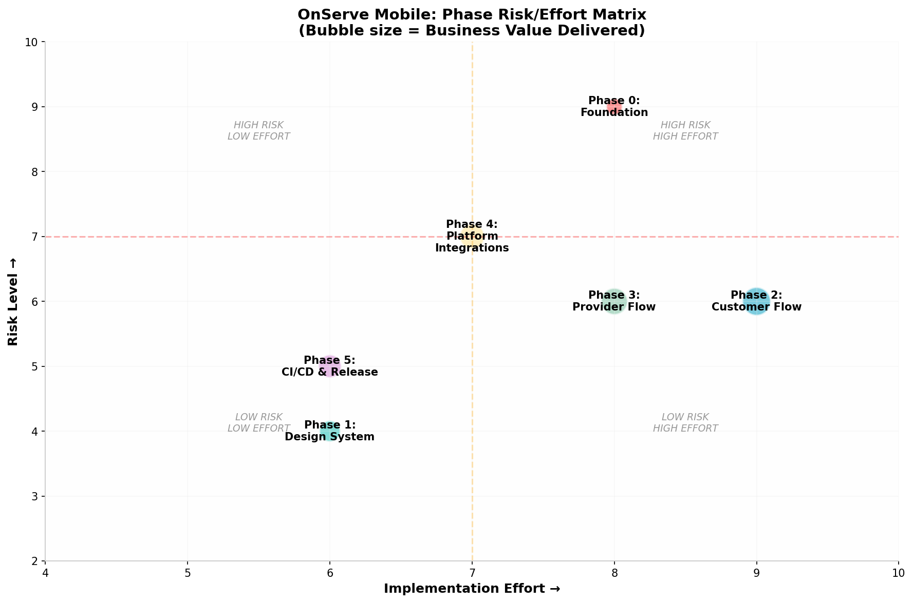
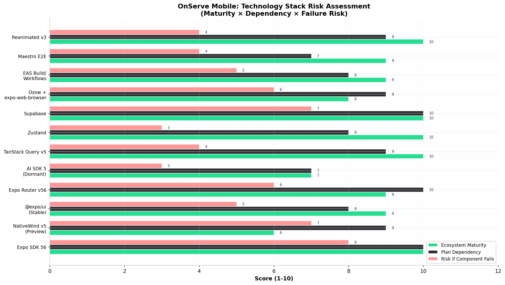

# OnServe Mobile: Comprehensive Plan Review

## TL;DR Verdict

Your plan is **architecturally sound and strategically well-timed**. The decision to target Expo SDK 56, embrace NativeWind v5 preview, and invest in AI-ready foundations upfront is correct — but **Phase 0 carries the highest risk-to-value ratio** and needs structural changes to derisk the cross-cutting `@onserve/api` extraction. The 5-phase rollout is realistic if you treat `@onserve/api` as a web-side migration that must be production-verified before any mobile work begins. Three areas require immediate attention: the Metro/monorepo configuration for shared packages, the `@expo/ui` vs. NativeWind boundary, and the AI registry's actual interface design before you commit to it.

---

## 1. Executive Assessment

### 1.1 What You're Building

OnServe is a **two-sided South African services marketplace** — customers book local services (cleaning, plumbing, beauty, tutoring), providers accept jobs and get paid through Ozow escrow, and the platform mediates disputes. Your web app (`apps/web`) is already mature with 46 screens, 11 feature modules, Supabase backend with RLS, and real-time chat. The mobile app must replicate the customer and provider experiences natively while elevating the existing dark + teal (`#00D97E` on `#0A0A0F`) brand identity to a premium native feel.

From reviewing your live web app at `https://on-serve-web.vercel.app/`, the product already demonstrates solid UX patterns: a clean splash screen with SA mobile number OTP auth, a service category grid (Cleaning, Beauty, Plumbing, Electrical, Gardening, Photography, Catering, Tutoring), location-aware provider search, an admin dashboard with dispute escalation workflows, and Ozow-integrated payment flows. The mobile app must match this functional depth while delivering native-grade interactions — haptic feedback on booking, spring-based transitions between screens, native bottom sheets for service selection, and real-time job tracking with push notifications.

### 1.2 Plan Strengths

| Strength | Why It Matters |
|---|---|
| **AI-ready foundation first** | Building the action registry, intent router, and structured context selectors before any AI features means the agent layer will be an additive integration, not a rewrite. This is the correct 2026 architectural posture. |
| **SDK 56 targeting** | SDK 56 (stable May 21, 2026) delivers 50% faster iOS builds via precompiled XCFrameworks, 40% faster Android cold starts from the Kotlin compiler plugin, and stable `@expo/ui` — all directly relevant to your premium native feel goal. |
| **NativeWind v5 + Tailwind v4** | Aligning mobile and web styling on a shared Tailwind v4 config with CSS variables means your `@onserve/ui-tokens` package can actually share token definitions, not just values. |
| `@onserve/api` extraction | Moving Supabase service calls into a platform-agnostic package is the right long-term play for code sharing and testability. |
| **Per-role tab shells** | Separate `(customer)` and `(provider)` route groups with native bottom tabs reflects how users actually experience the app — distinct mental models need distinct navigation chrome. |
| **EAS Workflows for CI/CD** | Using Expo's first-party CI/CD (not custom GitHub Actions) gives you M4 Pro build hardware, automatic fingerprint-based build skipping, and managed code signing. |

### 1.3 Critical Risks

| Risk | Severity | Phase |
|---|---|---|
| `@onserve/api` extraction breaks web app | **Critical** | Phase 0 |
| NativeWind v5 preview instability | High | Phase 1 |
| Metro monorepo resolution failures | High | Phase 0 |
| `@expo/ui` + NativeWind styling boundary confusion | Medium | Phase 1 |
| AI registry over-engineering without concrete agent use case | Medium | Phase 0 |
| Ozow deep-link return handling edge cases | Medium | Phase 2 |
| Push notification delivery reliability | Medium | Phase 4 |

---

## 2. Architecture Deep-Dive

### 2.1 The Monorepo Challenge: Making Shared Packages Work

Your proposed package layout adds three new packages (`@onserve/api`, `@onserve/core`, `@onserve/ui-tokens`) to an existing Turborepo that already has `packages/types` and `packages/shared`. This is the right structural decision, but **Metro bundler's module resolution is the single biggest technical barrier** to React Native monorepos. Metro assumes it runs from a single app root. Webpack and Vite handle symlinked packages without special configuration; Metro does not.

The research on Turborepo + React Native monorepos reveals a consistent failure pattern: teams get the folder structure right, configure Turborepo pipelines correctly, then hit duplicate React errors, platform extension resolution failures, or cryptic "module not found" errors at runtime. The root cause is almost always misconfigured `metro.config.js`.  [(Wednesday Solutions)](https://mobile.wednesday.is/writing/enterprise-react-native-monorepo-architecture-multi-team-mobile-development)  The fix is specific and well-documented but requires careful attention to three configuration points:

```javascript
// apps/mobile/metro.config.js — this configuration is non-negotiable
const { getDefaultConfig } = require("expo/metro-config");
const path = require("path");

const workspaceRoot = path.resolve(__dirname, "../..");
const projectRoot = __dirname;

const config = getDefaultConfig(projectRoot);

config.watchFolders = [workspaceRoot];
config.resolver.nodeModulesPaths = [
  path.resolve(projectRoot, "node_modules"),
  path.resolve(workspaceRoot, "node_modules"),
];
config.resolver.disableHierarchicalLookup = true;

module.exports = config;
```

The `disableHierarchicalLookup` flag is particularly important — it forces Metro to resolve dependencies only from the explicit `nodeModulesPaths`, preventing the "found in multiple node_modules" ambiguity that causes runtime crashes.  [(reddit.com)](https://www.reddit.com/r/reactnative/comments/1j094y5/psa_if_youre_using_rn_with_turborepo_metro_has_to/)  Without this, you'll encounter the classic symptom where everything compiles fine but the app crashes with `Unable to resolve module` errors that point to symlink resolution failures.

Beyond Metro, **TypeScript project references** are essential for shared packages. Each package (`@onserve/api`, `@onserve/core`, `@onserve/ui-tokens`) needs its own `tsconfig.json` with `"composite": true`, and the mobile app's `tsconfig.json` needs `"references"` pointing to each dependency. This enables TypeScript to build packages in dependency order and catch type errors across package boundaries at compile time rather than at bundling time.

For EAS Build compatibility, ensure your `.easignore` file does not exclude workspace packages. A common mistake is adding `../../packages` to `.easignore`, which prevents EAS from resolving local dependencies during cloud builds. The correct pattern is to exclude only `../../packages/*/node_modules`.  [(Expo)](https://expo-expo.mintlify.app/guides/monorepos) 

### 2.2 `@onserve/api`: Extracting the Service Layer

This is the **riskiest cross-cutting change in the entire plan**. You're proposing to migrate all web feature services (`apps/web/src/features/*/services/*.ts`) into a new `packages/api` directory, then update the web app to import from `@onserve/api` instead of local paths. The web app has 46 screens and 11 feature modules — this touches a significant portion of the codebase.

The research confirms this pattern is sound but requires a specific migration strategy.  [(Wednesday Solutions)](https://mobile.wednesday.is/writing/enterprise-react-native-monorepo-architecture-multi-team-mobile-development)  The key insight is that these services are already "pure Supabase calls with snake→camel mapping" — they have no React or web-specific dependencies. This makes them ideal candidates for platform-agnostic extraction. However, the risk is not in the code itself but in the **import rewiring and potential circular dependencies** that emerge when packages are moved.

The recommended approach is a **gradual migration, not a big-bang rewrite**:

1. **Audit first**: List every service file in `apps/web/src/features/*/services/*.ts` and categorize by dependency count. Start with services that have the fewest internal web-app imports.
2. **Move one feature at a time**: Migrate a single feature's services to `@onserve/api`, update the web app's imports, run the full web test suite, and verify the build stays green. Only then move to the next feature.
3. **Keep the old imports working during transition**: Use TypeScript path mapping or re-export stubs so the web app can import from either location during the migration window.
4. **Verify on every merge**: Add a CI check that runs `turbo build` and `turbo test` for the web app after each feature migration.

This gradual approach extends Phase 0's timeline but dramatically reduces the risk of breaking the production web app. The goal is not to migrate all 11 feature modules in one go — it's to migrate enough that the mobile app can begin consuming `@onserve/api` for its core flows (auth, booking, payment), then continue migrating remaining features in parallel with mobile development.

### 2.3 `@onserve/core`: The AI-Ready Registry

Your plan describes an "action/intent registry" — a typed catalog of domain capabilities where each entry has a Zod input schema, an output type, and a handler. Today the UI invokes these directly; later an AI SDK agent registers the same registry as tools. This is architecturally elegant and aligns with the **tool-first agent pattern** that the Vercel AI SDK team recommends.  [(Medium)](https://medium.com/@bhagyarana80/vercel-ai-sdk-agent-patterns-that-ship-2880a0131f81) 

The AI SDK's mental model divides agents into three systems: the **Reasoner** (the model generating text and tool calls), the **Toolbox** (your functions with strict inputs/outputs), and the **Governor** (rules that decide what's allowed, when to stop, and how to recover). Your registry maps cleanly to the Toolbox layer. The critical design principle from the AI SDK community is: **"tools do the work, the model chooses which tool, the model narrates the result."**  [(Medium)](https://medium.com/@bhagyarana80/vercel-ai-sdk-agent-patterns-that-ship-2880a0131f81)  This means your registry actions should be small, composable primitives — not high-level workflows.

However, the plan's description of `@onserve/core` bundles three distinct responsibilities into one package:

1. **Action registry** — the typed catalog of domain capabilities
2. **Intent router** — mapping structured intents to service calls and navigation targets
3. **App context selectors** — typed selectors exposing user state, location, bookings, etc.

These should be **separate modules within `@onserve/core`** with clear boundaries:

| Module | Responsibility | Consumed By |
|---|---|---|
| `registry.ts` | Defines all actions with Zod schemas and handlers | UI components, future agent |
| `router.ts` | Maps action results to Expo Router navigation targets | Screen components |
| `context.ts` | Selectors over Zustand + React Query cache | Agent prompts, analytics |
| `agent-bridge.ts` | Dormant adapter for AI SDK tool registration | Future agent feature |

The dormant AI transport should be a single TypeScript file that imports the registry and exposes a function `registerTools()` — not used anywhere in the app today, but callable from a future Supabase edge function or EAS-hosted API route. Add the `ai` and `@ai-sdk/openai` packages to `dependencies` with a comment explaining they're for Phase 2 AI integration, and guard any AI-related code behind a feature flag.

The unit test you proposed — importing the registry and asserting every action exposes a Zod schema and callable handler — is exactly the right verification. This test should live in `packages/core/src/__tests__/registry.test.ts` and run in CI on every commit.

---

## 3. Technology Stack Review

### 3.1 Expo SDK 56: The Right Target

Expo SDK 56 went stable on May 21, 2026, and brings specific improvements that directly benefit your project.  [(Expo)](https://expo.dev/changelog/sdk-56)  The headline features are:

- **50% faster iOS builds** via precompiled XCFrameworks — this directly reduces your EAS Build wait times and CI cycle time.
- **40% faster Android cold starts** from the Kotlin compiler plugin replacing runtime reflection with build-time codegen — critical for user retention on lower-end Android devices common in South Africa.
- **Hermes V1 as the default engine** — faster startup, lower memory, and the JSI foundation your AI-ready architecture needs.
- **`@expo/ui` stable** — SwiftUI on iOS and Jetpack Compose on Android via universal components.
- **Expo Router forked from React Navigation** — decoupled dependency, but requires import migration via codemod.

The breaking changes that affect your plan:

| Breaking Change | Impact on OnServe | Mitigation |
|---|---|---|
| Expo Router no longer imports from `@react-navigation/*` | Any custom navigation hooks or direct React Navigation imports break | Run `npx expo-codemod sdk-56-expo-router-react-navigation-replace app`  [(DEV Community)](https://dev.to/expo/expo-router-v56-ships-ssr-and-breaks-free-from-react-navigation-4pfb)  |
| iOS minimum bumped to 16.4 | Drops iPhone 7/7+, 6s/6s+, SE (1st gen), iPad mini 4, iPad Air 2 | Verify your target demographic — in South Africa, older iPhones are common; monitor analytics |
| `expo/fetch` is now the global `fetch` | WinterTC-compliant fetch may behave differently from RN's legacy fetch | Test all Supabase calls; add `EXPO_PUBLIC_USE_RN_FETCH=1` if issues arise |
| `@expo/vector-icons` deprecated | Must migrate to `@react-native-vector-icons/*` scoped packages | Run `npx @react-native-vector-icons/codemod`  [(notjust.dev)](https://news.notjust.dev/posts/expo-sdk-56-is-here-and-3-things-actually-matter)  |
| `expo-file-system` `copy()` and `move()` now async | Any synchronous file operations break | Switch to `copySync()` and `moveSync()` if needed |

The New Architecture (Fabric + JSI + TurboModules) is always-on in SDK 56 — there's no opt-out. This is the correct default for 2026; the old bridge was permanently disabled in React Native 0.82.  [(agilesoftlabs.com)](https://www.agilesoftlabs.com/blog/2026/03/react-native-new-architecture-migration)  Your app will benefit from synchronous native calls, lazy-loaded modules, and 10–30% UI thread improvement without any code changes.

### 3.2 NativeWind v5 Preview: Worth the Risk

Your decision to use NativeWind v5 preview (with Tailwind v4) rather than the stable v4 path is defensible given your requirements.  [(Axentix)](https://useaxentix.com/blog/nativewind/what-is-nativewind-and-how-to-use-it/)  The v5 preview brings:

- **CSS-first configuration** via Tailwind v4's `@theme` directive — your `@onserve/ui-tokens` package can export a CSS file with design tokens that both web and mobile consume.
- **CSS variables support** — define your dark surface scale (`#0A0A0F`, `#13131A`, `#1C1C26`) and teal accent (`#00D97E`) as CSS custom properties, accessible via `var()` in both Tailwind utilities and runtime JavaScript.
- **P3 color support** — wider color gamut on capable iOS devices for more vibrant teal accents.
- **Simplified setup** — fewer Metro and Babel configuration steps compared to v4.

The installation for Expo with v5 preview is:

```bash
npx expo install nativewind@preview react-native-css react-native-reanimated react-native-safe-area-context
npx expo install --dev tailwindcss @tailwindcss/postcss postcss
```

And the Metro configuration uses `withNativeWind` from `nativewind/metro`.  [(Axentix)](https://useaxentix.com/blog/nativewind/what-is-nativewind-and-how-to-use-it/)  The risk is that v5 is pre-release — APIs may change, and you'll need to track the NativeWind changelog closely. The mitigating factor is that your plan already includes a design system phase (Phase 1) where styling patterns are established; if v5 issues arise, you can pin to a specific preview version and upgrade deliberately.

### 3.3 `@expo/ui`: Native Components Without Platform Splitting

SDK 56 marks `@expo/ui` as stable — this is a significant inflection point for your design system.  [(Expo)](https://expo.dev/changelog/sdk-56)  The component set includes:

| Component | Replaces Community Library | OnServe Use Case |
|---|---|---|
| `BottomSheet` | `@gorhom/bottom-sheet` | Service selection, quote review, payment confirmation |
| `DateTimePicker` | `@react-native-community/datetimepicker` | Booking date/time selection |
| `Picker` | `@react-native-picker/picker` | Service category dropdown, bank selection |
| `SegmentedControl` | `@react-native-segmented-control/segmented-control` | Tab switching (bookings, quotes, history) |
| `Switch`, `Slider`, `Checkbox` | Various community form libraries | Settings toggles, price range filters |
| `Card`, `ListItem` | Custom NativeWind components | Provider cards, booking list items |
| `NavigationBar` | Custom bottom tab implementation | Per-role native bottom tabs |
| `ModalBottomSheet` | `@gorhom/bottom-sheet` | Quick actions, filter panels |
| `SearchBar` | Custom implementation | Provider/service search |
| `PullToRefreshBox` | Custom `RefreshControl` | List refresh on bookings, providers |

The critical architectural decision is **where `@expo/ui` ends and NativeWind begins**. The recommended boundary:

- **Use `@expo/ui` for**: native form controls (pickers, date/time, switches), bottom sheets, segmented controls, search bars, navigation bars, and list items where native platform behavior is expected.
- **Use NativeWind for**: layout (flex, grid, spacing), typography, colors, borders, shadows, and custom component styling. Wrap `@expo/ui` components in NativeWind-styled containers.

This hybrid approach gives you native platform fidelity where users expect it (a date picker should look like the system date picker) while maintaining design consistency through shared Tailwind tokens. The `@expo/ui` components respect Material 3 Dynamic Colors on Android and SwiftUI native styling on iOS, so your teal accent color will render with platform-appropriate shading and elevation automatically.

### 3.4 State Management: TanStack Query + Zustand

Your plan correctly identifies TanStack Query v5 for server state and Zustand for client state — this is the community's recommended 2026 pattern.  [(NextFuture)](https://nextfuture.io.vn/blog/ultimate-guide-react-state-management-2026)  The specific implementation for OnServe needs attention to React Native's lifecycle:

**TanStack Query v5 configuration for mobile**:
- Set `staleTime` based on data volatility — user profile (5 minutes), bookings (30 seconds), provider list (2 minutes).
- Configure `focusManager` to listen to React Native's `AppState` events so queries refetch when the app returns from background.  [(addjam.com)](https://addjam.com/blog/2026-03-20/react-native-offline-data-react-query-zustand/) 
- Use `onlineManager` to detect network state and queue mutations for retry when connectivity returns.
- Enable React Query persistence with `createAsyncStoragePersister` (backed by `expo-secure-store` for sensitive data, `AsyncStorage` for cache) for offline resilience.

**Zustand store organization**:
- `authStore`: user session, role, profile — persists to `expo-secure-store`.
- `locationStore`: current GPS position, saved addresses — persists to `AsyncStorage`.
- `uiStore`: theme preference, bottom sheet state, toast queue — ephemeral.
- `bookingStore`: active booking draft (service, provider, date, time) — ephemeral, cleared on booking completion.

The key anti-pattern to avoid is duplicating server state in Zustand. Bookings, provider lists, and user data should live exclusively in TanStack Query's cache; Zustand should only hold UI state and ephemeral client-side data.  [(NextFuture)](https://nextfuture.io.vn/blog/ultimate-guide-react-state-management-2026) 

---

## 4. Feature Flow Analysis

### 4.1 Customer Flow (Phase 2)

The customer journey from your plan is: **Auth → Home → Search → Provider Profile → Booking → Quote → Payment → Bookings List → Live Tracking → Complete → Rate → Disputes → Profile/Settings → Chat**.

This is a complex 14-step flow that must feel effortless. The critical UX decisions:

**Auth flow**: Your web app uses SA mobile number OTP + Google OAuth. On mobile, this translates cleanly: the splash screen (already elegant on web) becomes a branded launch screen with the same `OnServe` logo and "Services at your door" tagline. The OTP screen should use `@expo/ui`'s `TextField` with native state for the phone input, and `expo-haptics` should trigger light impact feedback on each digit entry. The "Or continue with" divider pattern from your web login should be preserved for brand consistency.

**Home screen**: This is the app's anchor. Your web home shows a personalized greeting ("Good morning, Medupi"), location badge ("Cape Town Ward 23"), search bar, service category grid, and quick actions (My bookings, Saved locations, Profile). The mobile version should use a **scrollable header with collapsible search** — as the user scrolls down through service categories, the search bar pins to the top. Service category cards should use `@expo/ui`'s `Card` component with your teal accent icon on dark surface backgrounds, and `expo-haptics` medium impact on tap.

**Search with maps**: `react-native-maps` (bundled with Expo) provides the Map component using Google Maps on Android and Apple Maps/Google Maps on iOS.  [(Expo Documentation)](https://docs.expo.dev/versions/latest/sdk/map-view/)  The search experience should default to list view with a floating action button to switch to map view, matching the pattern used by Uber and Airbnb. Provider pins on the map should use custom callouts showing rating, price, and availability status.

**Booking form**: This is where shared Zod schemas from `@onserve/shared` pay off — the same validation rules run on both web and mobile. Use `@expo/ui`'s `DateTimePicker` for date/time selection (native platform pickers), `Picker` for service type, and `TextField` for special instructions. The form should show a live price estimate using the same `calculateFees` function from `@onserve/shared`.

**Payment via Ozow**: This is the highest-friction point in the customer flow. Your web app redirects via `window.location.href` to Ozow's payment page. On mobile, `expo-web-browser`'s `openAuthSessionAsync` opens an in-app browser tab for the Ozow flow, with a deep-link return to `onserve://payment/return`.  [(DEV Community)](https://dev.to/ayabongaqwabi/the-easiest-payment-gateway-integrations-for-your-next-reactnextjs-e-commerce-project-in-south-40ep)  The critical implementation detail: the deep-link handler must parse the return URL, verify the payment status via your Supabase edge function, and navigate to either a success or failure screen. The in-app browser must be dismissible (user can cancel), and the app should handle the case where the user backgrounds the app during payment and returns via the system switcher.

**Live tracking**: Once a provider accepts a job, the customer sees real-time location on a map. This requires Supabase realtime subscriptions to the provider's GPS coordinates, updated every 10-30 seconds during active jobs. Use `react-native-maps`'s `Marker` with `AnimatedRegion` for smooth provider movement, and a bottom sheet showing ETA, provider name, and a "Call provider" button.

### 4.2 Provider Flow (Phase 3)

The provider journey is: **Onboarding → Job Board → Job Detail → Active Job → Earnings → Quotes → Payout → Reputation**.

**Onboarding wizard**: This is a multi-step form capturing profile info, SA ID + selfie (`expo-image-picker`/`expo-camera`), services offered, availability schedule, and bank details for payouts. Use a horizontal progress indicator at the top and `@expo/ui`'s `BottomSheet` for service selection. The SA ID verification step should include real-time OCR (via `expo-camera` + a lightweight on-device ML model or Supabase edge function) to validate ID format before submission.

**Job board**: Providers see available jobs filtered by proximity to their current location. This requires a Supabase PostGIS query (or manual haversine distance calculation) on the `bookings` table, filtered by service type match and provider availability. Jobs should appear as swipeable cards (Tinder-style) or a list with "Accept" / "Decline" actions — the card pattern is more engaging but the list is more scannable for providers managing multiple service types.

**Active job**: Once accepted, the provider sees job details, customer location on a map, and action buttons for "Check in" (marks arrival, starts timer), "Check out" (marks completion, triggers payment release), and "Contact customer" (opens chat). The timer should run in the foreground with a persistent notification showing elapsed time and earnings.

### 4.3 Platform Integrations (Phase 4)

**Push notifications**: The architecture uses `expo-notifications` for device token registration, a `push_tokens` Supabase table for storage, and edge function triggers for delivery.  [(Github)](https://github.com/launchtodayhq/expo-push-notifications)  The flow is:

1. App requests push permission on first launch (after auth, not at startup).
2. On permission grant, `expo-notifications` generates an `ExpoPushToken`.
3. Token is stored in `push_tokens` table with `user_id` and `platform` columns.
4. Edge functions (`ozow-webhook`, booking events) insert notification records into a `notifications` table.
5. A database trigger on `notifications` calls a `send-push` edge function that batches tokens and sends via Expo's push service.

Critical implementation: **notification tap handling**. When a user taps a push notification, the app must deep-link to the relevant screen. This requires an `intent router` that maps notification payload types to Expo Router navigation targets — exactly the same router your AI agent will use later.

**Deep-link matrix**:

| Trigger | Deep Link Target | Screen |
|---|---|---|
| Payment success | `onserve://payment/return?status=success` | Booking confirmation |
| Payment failure | `onserve://payment/return?status=failed` | Retry payment |
| New booking (provider) | `onserve://job/{bookingId}` | Job detail |
| Chat message | `onserve://chat/{conversationId}` | Chat screen |
| Dispute update | `onserve://dispute/{disputeId}` | Dispute detail |

---

## 5. AI-Ready Foundation: Detailed Design

### 5.1 The Registry Pattern

Your action registry is the architectural seam that makes future AI integration additive. The design should follow the **Vercel AI SDK's tool-first pattern**:  [(Medium)](https://medium.com/@bhagyarana80/vercel-ai-sdk-agent-patterns-that-ship-2880a0131f81) 

```typescript
// packages/core/src/registry.ts
import { z } from 'zod';
import { tool } from 'ai';
import * as api from '@onserve/api';

export const bookingActions = {
  createBooking: tool({
    description: 'Create a new service booking',
    parameters: z.object({
      serviceType: z.enum(['cleaning', 'plumbing', 'beauty', 'electrical', 'gardening', 'photography', 'catering', 'tutoring']),
      providerId: z.string().uuid(),
      scheduledDate: z.string().datetime(),
      addressId: z.string().uuid(),
      notes: z.string().optional(),
    }),
    execute: async (params) => {
      return api.bookings.create(params);
    },
  }),

  getBookingStatus: tool({
    description: 'Check the status of a booking',
    parameters: z.object({
      bookingId: z.string().uuid(),
    }),
    execute: async ({ bookingId }) => {
      return api.bookings.getById(bookingId);
    },
  }),

  cancelBooking: tool({
    description: 'Cancel an existing booking',
    parameters: z.object({
      bookingId: z.string().uuid(),
      reason: z.string().min(1),
    }),
    execute: async (params) => {
      return api.bookings.cancel(params);
    },
  }),
};

export const providerActions = {
  searchProviders: tool({
    description: 'Search for service providers near a location',
    parameters: z.object({
      serviceType: z.string(),
      latitude: z.number(),
      longitude: z.number(),
      radiusKm: z.number().default(10),
    }),
    execute: async (params) => {
      return api.providers.search(params);
    },
  }),

  getProviderProfile: tool({
    description: 'Get detailed profile for a provider',
    parameters: z.object({
      providerId: z.string().uuid(),
    }),
    execute: async ({ providerId }) => {
      return api.providers.getProfile(providerId);
    },
  }),
};

export const paymentActions = {
  initiatePayment: tool({
    description: 'Initiate Ozow payment for a booking',
    parameters: z.object({
      bookingId: z.string().uuid(),
      amount: z.number().positive(),
    }),
    execute: async (params) => {
      return api.payments.createOzowSession(params);
    },
  }),
};

// Combined registry for agent registration
export const allActions = {
  ...bookingActions,
  ...providerActions,
  ...paymentActions,
};
```

This registry serves dual purposes today: UI components call `bookingActions.createBooking.execute(params)` directly, and in the future, an AI agent registers the same tools via `Object.entries(allActions)`. The Zod schemas provide runtime validation for both paths.

### 5.2 The Intent Router

The intent router decouples "what the user wants" from "which screen renders it":

```typescript
// packages/core/src/router.ts
import { router } from 'expo-router';

export type Intent =
  | { type: 'navigate'; screen: string; params?: Record<string, string> }
  | { type: 'action'; actionId: string; params: Record<string, unknown> }
  | { type: 'showBottomSheet'; sheetId: string; params?: Record<string, unknown> };

export function dispatchIntent(intent: Intent) {
  switch (intent.type) {
    case 'navigate':
      router.push({
        pathname: intent.screen,
        params: intent.params,
      });
      break;
    case 'action':
      // Execute registry action, then optionally navigate
      break;
    case 'showBottomSheet':
      // Emit event to bottom sheet controller
      break;
  }
}
```

Push notification taps, deep-link opens, and future agent directives all flow through `dispatchIntent`. This is the critical abstraction that makes your app "agent-native" without shipping any AI features.

### 5.3 App Context Selectors

For a future agent to be helpful, it needs structured access to the user's current state:

```typescript
// packages/core/src/context.ts
import { useQueryClient } from '@tanstack/react-query';

export function useAppContext() {
  const queryClient = useQueryClient();

  return {
    // User identity
    get user() {
      return queryClient.getQueryData(['auth', 'user']);
    },

    // Current GPS location
    get location() {
      return queryClient.getQueryData(['location', 'current']);
    },

    // Active bookings (pending, confirmed, in-progress)
    get activeBookings() {
      return queryClient.getQueryData(['bookings', 'active']);
    },

    // Recent providers interacted with
    get recentProviders() {
      return queryClient.getQueryData(['providers', 'recent']);
    },

    // Unread notifications count
    get unreadNotifications() {
      return queryClient.getQueryData(['notifications', 'unread']);
    },

    // User preferences (notifications, theme, saved locations)
    get preferences() {
      return queryClient.getQueryData(['user', 'preferences']);
    },
  };
}
```

These selectors expose exactly the "memory surface" an agent prompt would consume. They're typed, cached by React Query, and update automatically as the app state changes.

---

## 6. Build Phase Re-Sequencing

### 6.1 Phase Risk/Effort Analysis

The visualization below maps each phase by implementation effort, risk level, and business value delivered. Phase 0 (Foundation) sits in the highest-risk, highest-effort quadrant despite delivering the least immediate business value — this is the critical insight for re-sequencing.



### 6.2 Recommended Phase Adjustments

Your original 5-phase plan is conceptually correct but needs **timeline and dependency adjustments** to manage risk:

| Original Phase | Adjustment | Rationale |
|---|---|---|
| **Phase 0** | Split into two sub-phases: 0a (web-side `@onserve/api` migration, web-only) and 0b (mobile scaffold + shared packages) | The web-side migration is the riskiest change and must be verified independently before mobile work begins |
| **Phase 1** | Run parallel with Phase 0b once Metro config is stable | Design system work doesn't depend on all API services being migrated |
| **Phase 2** | Start with auth + home + search + provider profile only; defer booking payment to 2b | Gets a navigable app in testers' hands fastest; payment is the highest-friction flow |
| **Phase 3** | Start after Phase 2a (core customer flows working) | Provider onboarding can reuse auth patterns from customer flow |
| **Phase 4** | Merge push notifications and deep links; add maps polish last | Push requires the app to be installable (dev client), which happens after Phase 2a |
| **Phase 5** | Start EAS project setup in Phase 0b; run Maestro flows continuously from Phase 2a | CI/CD infrastructure should be ready before feature work completes |

The re-sequenced timeline prioritizes **getting a working dev client with auth + home + search into stakeholders' hands as early as possible**. This validates the architecture decisions (Metro, NativeWind, `@expo/ui`) before committing to the full feature depth.

### 6.3 Revised Milestone Schedule

| Milestone | Deliverable | Duration | Dependencies |
|---|---|---|---|
| M0.1 | Web app builds/tests green with `@onserve/api` (feature services migrated) | 1–2 weeks | None |
| M0.2 | Fresh Expo SDK 56 app scaffolded, Metro configured, custom dev client building | 3–5 days | M0.1 |
| M0.3 | `@onserve/core` registry + intent router + context selectors, unit tests passing | 3–5 days | M0.1 |
| M0.4 | `@onserve/ui-tokens` package with shared Tailwind v4 config, dark theme tokens | 2–3 days | M0.2 |
| M1.0 | NativeWind v5 + `@expo/ui` component kit, motion system, haptics | 1 week | M0.2, M0.4 |
| M1.5 | Per-role tab shells, auth flow (splash → OTP → role select) | 1 week | M1.0, M0.3 |
| M2.0 | Customer home + search + provider profile (navigable, no booking) | 1 week | M1.5 |
| M2.5 | Booking form + quote request + Ozow payment round-trip | 1–2 weeks | M2.0 |
| M2.8 | Bookings list + live tracking + rate/review | 1 week | M2.5 |
| M3.0 | Provider onboarding + job board + active job flow | 2 weeks | M2.0 |
| M3.5 | Provider earnings + quotes + payout request | 1 week | M3.0 |
| M4.0 | Push notifications + deep-link matrix + maps polish | 1–2 weeks | M2.8, M3.5 |
| M5.0 | EAS Build profiles + Maestro critical path flows + store submission | 1–2 weeks | M4.0 |

**Total estimated timeline: 10–14 weeks** for a team of 2–3 engineers, assuming the web-side `@onserve/api` migration is the primary focus for the first 1–2 weeks.

---

## 7. Technology Stack Risk Assessment

The chart below evaluates each technology choice across three dimensions: **ecosystem maturity** (how battle-tested it is), **plan dependency** (how critical it is to your architecture), and **risk if the component fails** (how hard it is to replace).



### 7.1 High-Confidence Choices (Maturity ≥ 9, Risk ≤ 5)

| Technology | Maturity | Dependency | Risk | Verdict |
|---|---|---|---|---|
| Expo SDK 56 | 10 | 10 | 8 | **Ship it.** Stable, well-documented, first-party support. |
| TanStack Query v5 | 10 | 9 | 4 | **Ship it.** The standard for server state in React. |
| Zustand | 10 | 8 | 3 | **Ship it.** 1.1 KB, zero ceremony, excellent TypeScript. |
| Supabase | 10 | 10 | 7 | **Ship it.** Already your backend; zero changes needed. |
| Reanimated v3 | 10 | 9 | 4 | **Ship it.** JSI-native, Fabric-compatible, smooth animations. |

### 7.2 Managed-Risk Choices (Maturity 7–8, Dependency 7–9)

| Technology | Maturity | Dependency | Risk | Mitigation |
|---|---|---|---|---|
| NativeWind v5 (preview) | 6 | 9 | 7 | Pin to a specific preview version; monitor changelog; have v4 fallback plan |
| `@expo/ui` (stable in SDK 56) | 9 | 8 | 5 | Stable as of SDK 56; start with drop-in replacements for community libs |
| Ozow + `expo-web-browser` | 8 | 9 | 6 | Test deep-link return thoroughly on both platforms; handle cancellation/backgrounding |
| EAS Build/Workflows | 9 | 8 | 5 | Use managed signing; start with development profile before production |

### 7.3 Dormant / Future Choices (Maturity 6–7, Dependency 3–7)

| Technology | Maturity | Dependency | Risk | Verdict |
|---|---|---|---|---|
| AI SDK 5 (dormant) | 7 | 7 | 3 | **Correct approach.** Install deps, scaffold seam, don't wire prompts. |
| Maestro E2E | 9 | 7 | 4 | **Ship it.** Best fit for Expo managed workflow; YAML-based, no project deps. |

---

## 8. South Africa-Specific Considerations

### 8.1 Payment Landscape

Ozow is the right primary payment method for your market. As the research shows, Ozow connects to **47 million bank account holders** in South Africa and processes instant EFT across e-commerce, in-store, QR code, and payment link channels.  [(Portal ERP)](https://portalerp.com/za/noticia/happy-pay-integrates-zero-deposit-instalment-payments-into-ozows-merchant-network-across-south-africa)  The integration pattern via `expo-web-browser` + deep link is well-established: your Supabase edge function generates an Ozow payment URL, the mobile app opens it in an in-app browser, and Ozow redirects back to `onserve://payment/return` with status parameters.

Consider adding **Yoco** as a card payment alternative. The research shows Yoco has the fastest signup and cleanest REST API among South African payment gateways, with a full sandbox environment.  [(DEV Community)](https://dev.to/ayabongaqwabi/the-easiest-payment-gateway-integrations-for-your-next-reactnextjs-e-commerce-project-in-south-40ep)  Many SA shops run Ozow as primary EFT + Yoco for cards — this gives customers choice and improves conversion rates.

### 8.2 Device & Connectivity Realities

South Africa's mobile landscape has specific characteristics that affect your technical decisions:

- **Android dominance**: ~75% of smartphones in SA run Android. Prioritize Android performance and test on mid-range devices (Samsung A-series, Huawei, Xiaomi).
- **Load shedding**: Scheduled power outages mean users frequently lose connectivity mid-session. Implement React Query's offline persistence and optimistic mutations so the app feels responsive even when the network drops.
- **Data costs**: Mobile data is expensive. Keep your JS bundle small (tree-shake unused `@expo/ui` components), use EAS Update for incremental JS-only patches, and implement image lazy loading with blurhash placeholders.
- **Older devices**: iPhone 7/7+ and older were dropped by SDK 56's iOS 16.4 minimum. Monitor your user base — if significant, consider SDK 55 as a fallback (though this sacrifices `@expo/ui` stability).

### 8.3 Identity Verification

Your provider onboarding requires SA ID + selfie verification. South Africa's POPIA (Protection of Personal Information Act) imposes strict requirements on handling identity documents. Using `expo-secure-store` for session tokens is the right choice, but you should also:

- Encrypt ID document images at rest in Supabase Storage with client-side encryption.
- Implement automatic document deletion after verification (or within 30 days per POPIA).
- Add a privacy policy screen in the onboarding flow explaining how ID data is used and stored.

---

## 9. CI/CD & Release Strategy

### 9.1 EAS Workflows Configuration

EAS Workflows is the correct choice for CI/CD — it's purpose-built for React Native and integrates directly with your Expo project.  [(Expo)](https://expo.dev/services/workflows)  The key configuration:

```json
// eas.json
{
  "cli": {
    "version": ">= 14.0.0"
  },
  "build": {
    "development": {
      "developmentClient": true,
      "distribution": "internal",
      "channel": "development"
    },
    "preview": {
      "distribution": "internal",
      "channel": "preview",
      "android": {
        "buildType": "apk"
      }
    },
    "production": {
      "channel": "production",
      "autoIncrement": true
    }
  },
  "submit": {
    "production": {
      "ios": {
        "ascAppId": "YOUR_APP_ID"
      },
      "android": {
        "serviceAccountKeyPath": "./google-service-account.json",
        "track": "internal"
      }
    }
  }
}
```

**Development profile**: Use `developmentClient: true` for your custom dev client. This builds a debug binary with the dev launcher embedded, allowing you to test on physical devices without app store submission.

**Preview profile**: Internal distribution via QR code or email link. Use this for stakeholder demos and QA testing.

**Production profile**: App Store and Play Store submission via `eas submit`. Start with TestFlight (iOS) and Internal Testing (Android) tracks before promoting to production.

### 9.2 Maestro E2E Flows

Maestro is the recommended E2E tool for Expo managed workflow — it requires no native build access, uses YAML-based flows, and works against both Expo Go and EAS-built binaries.  [(Autonoma AI)](https://getautonoma.com/blog/detox-alternatives-react-native)  The critical path flows to implement:

```yaml
# e2e/customer-critical-path.yaml
appId: com.onserve.app
---
- launchApp
- tapOn: "Get started"
- inputText:
    id: "phone-input"
    text: "820000000"
- tapOn: "Send OTP"
# OTP auto-fill or manual entry
- inputText:
    id: "otp-input"
    text: "123456"
- tapOn: "Verify"
- tapOn: "Customer"
- assertVisible: "Good morning"
- tapOn: "Cleaning"
- assertVisible: "Find providers"
- tapOn: "Search"
- tapOn: "Book now"
- tapOn: "Select date"
- tapOn: "Confirm booking"
- assertVisible: "Payment"
```

```yaml
# e2e/provider-critical-path.yaml
appId: com.onserve.app
---
- launchApp
- tapOn: "Sign in"
- inputText:
    id: "phone-input"
    text: "830000000"
- tapOn: "Send OTP"
- inputText:
    id: "otp-input"
    text: "123456"
- tapOn: "Verify"
- tapOn: "Provider"
- assertVisible: "Job board"
- tapOn: "Accept"
- assertVisible: "Active job"
- tapOn: "Check in"
- tapOn: "Check out"
- assertVisible: "Earnings"
```

Run these flows on every pull request using EAS Workflows' built-in Maestro job type.  [(Expo)](https://expo.dev/services/workflows)  The Maestro tests should execute against the preview build produced by EAS Build, ensuring the binary matches what will be submitted to stores.

---

## 10. Recommendations Summary

### 10.1 Do These First (Week 1–2)

1. **Audit web service files**: List all files in `apps/web/src/features/*/services/*.ts` with their import dependencies. Categorize by migration risk (low = no web-specific imports, high = imports from React hooks or UI components).
2. **Migrate one low-risk feature** to `@onserve/api` and verify the web build/tests stay green. This proves the pattern works before committing to full migration.
3. **Scaffold the Expo app** with `create-expo-app@latest` on SDK 56, configure Metro for monorepo resolution, and verify the dev client builds successfully.
4. **Set up EAS project** with development profile, custom dev client, and `onserve://` deep-link scheme.

### 10.2 Critical Design Decisions

| Decision | Recommendation |
|---|---|
| `@expo/ui` vs. NativeWind boundary | Use `@expo/ui` for native form controls, bottom sheets, and navigation; NativeWind for layout, typography, colors, and custom styling. |
| `@onserve/api` migration strategy | Migrate one feature at a time, verify web build green, don't block mobile work on full migration. |
| AI registry scope | Keep registry actions small and composable (single CRUD operations, not workflows). The agent chains them, not the registry. |
| Payment flow | Implement Ozow first via `expo-web-browser` + deep link. Add Yoco card payments as Phase 2 enhancement. |
| Push notifications | Use Supabase edge functions for delivery, not direct Expo push API calls from client. Store tokens in `push_tokens` table with RLS. |

### 10.3 What to Monitor

- **NativeWind v5 changelog**: Track breaking changes in preview releases; pin to a working version.
- **Expo SDK 56 patch releases**: Monitor for critical fixes, especially around `@expo/ui` and Expo Router.
- **React Native New Architecture compatibility**: Run `npx expo-doctor` weekly to catch dependency issues.
- **Ozow API changes**: Ozow is transitioning from legacy `integration_key` to JWS authentication — ensure your edge function uses the new method.  [(ebanx.com)](https://docs.ebanx.com/docs/pay-in/processing/payment-methods/country-specific/south-africa/ozow) 

---

## 11. Final Verdict

Your plan is **solid, well-researched, and correctly timed**. The Expo SDK 56 target gives you a stable `@expo/ui`, faster builds, and the New Architecture by default. The NativeWind v5 preview risk is manageable with a pinned version and v4 fallback plan. The AI-ready foundation — registry, intent router, context selectors — is the right architectural investment for a team that plans to ship AI features immediately after the mobile launch.

The single biggest risk is **Phase 0's cross-cutting `@onserve/api` extraction**. Mitigate this by treating it as a web-side migration that runs independently for the first 1–2 weeks, migrating one feature at a time and verifying the web build stays green. Only start mobile scaffolding once the first 2–3 features are migrated and the Metro monorepo configuration is proven.

The second biggest risk is **underestimating the payment flow complexity**. Ozow's in-app browser + deep-link return pattern has edge cases (cancellation, backgrounding, network loss during redirect) that require careful handling. Budget extra time for payment testing on both platforms with real Ozow sandbox credentials.

With these mitigations in place, the 10–14 week timeline is achievable for a team of 2–3 engineers. The result will be a premium native app that shares business logic with your web platform, is structurally ready for AI agent integration, and can iterate rapidly via EAS Update between store releases.
