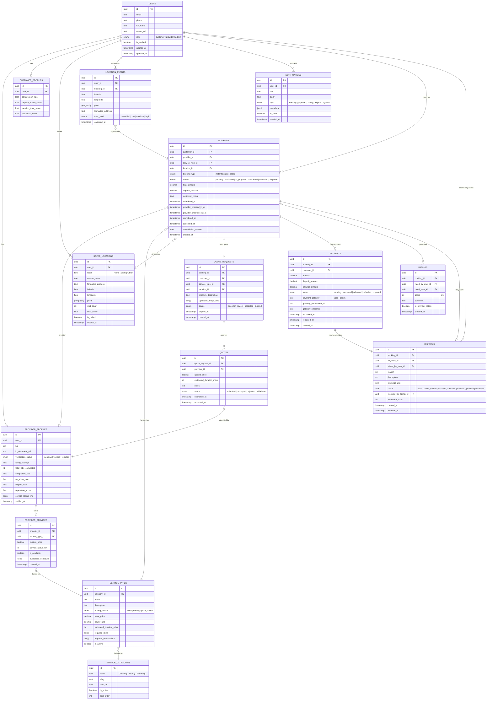

# OnServe — Entity Relationship Diagram

Full database schema for the OnServe POC. Designed for PostgreSQL via Supabase with PostGIS extension for geo queries.

---

## Full ERD

---

## Key Design Decisions

### 1. Location is a first-class entity
Bookings are tied to `saved_locations`, not just coordinates. Every booking captures a `location_event` with trust metadata at that moment in time.

### 2. Dual reputation scores
Both `provider_profiles` and `customer_profiles` carry computed reputation scores. These are updated via Supabase Edge Functions after each completed booking/rating.

### 3. Quote flow as a separate path
`quote_requests` and `quotes` are separate from `bookings`. A booking is only created once a quote is accepted — keeping the data model clean.

### 4. Payment state machine
Payments have their own status lifecycle (`escrowed → released`) separate from booking status. This allows disputes to freeze payment without changing booking state.

### 5. PostGIS for location queries
`saved_locations.point` and `location_events.point` use PostGIS `geography` type enabling:
- Distance-based provider search (`ST_DWithin`)
- Area-level risk aggregation
- Provider radius matching

---

## Supabase RLS Policy Summary

| Table | Customer | Provider | Admin |
|---|---|---|---|
| `users` | Read own | Read own | Full access |
| `saved_locations` | CRUD own | Read (for jobs) | Full access |
| `bookings` | CRUD own | Read/update assigned | Full access |
| `payments` | Read own | Read own | Full access |
| `ratings` | CRUD own | Read | Full access |
| `disputes` | CRUD own | Read own | Full access |
| `provider_profiles` | Read all | CRUD own | Full access |
| `service_types` | Read all | Read all | Full access |
